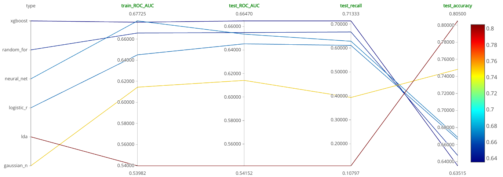
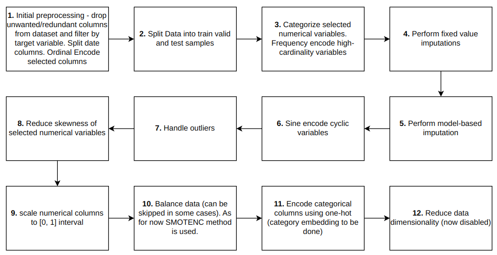
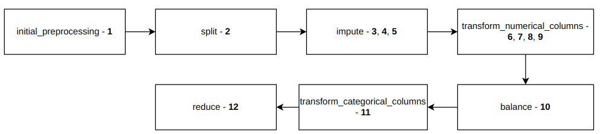
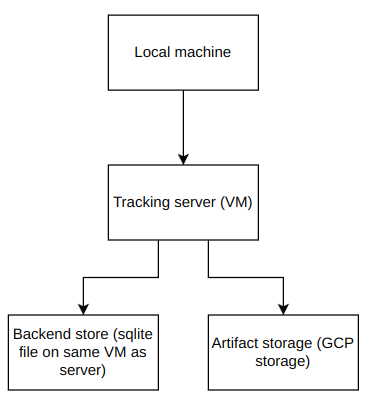

# Default prediction
The aim of this project is to create machine learning model, which predicts whether bank customer will default on an loan. Various models have been tried. As for now best model is gradient boosting implemented in `xgboost` library. [Link to dataset](https://www.kaggle.com/code/faressayah/lending-club-loan-defaulters-prediction/data).

## Technologies
Technologies used inside project:
* `Python`
* `Python` data science stack (`pandas`, `sklearn`, `numpy`, ...)
* `Tensorflow`
* `Optuna`
* `DVC`
* `MlFlow`
* `Docker`
* `GCP`
* lots of minor libraries

## Models
As for now the best model is xgboost since it has highest ROC AUC and recall.
I think that recall in this case in one of the most important metrics. However,
it requires more complex business analysis which I cannot perform without more data.

**Comparison**
| Model | Train ROC AUC | Test ROC AUC | Test recall | Test accuracy |
|-------|---------------|--------------|-------------|---------------|
|XGBoost|0.68|0.67|0.71|0.64|
|Random forest|0.67|0.66|0.67|0.65|
|Neural network|0.68|0.65|0.63|0.67|
|Logistic regression|0.65|0.65|0.61|0.67|
|LDA|0.54|0.54|0.11|0.8|
|Naive Bayes|0.61|0.61|0.4|0.75|


_When model doesn't differ significantly between train and test sample in ROC AUC, I consider it as not overfitted._

## Data preprocessing
### Concept
Data processing is performed in following steps:


### DVC implementation
This corresponds to following stages in DVC (_bolded numbers mean that steps from previous diagram are performed in this DVC stage_)


* **initial_preprocessing** - performs initial data cleaning like removal of unwanted columns and minor preprocessing.
* **split** - splits data into train, validation and test samples.
* **clean** - removes missing values from data by imputing special categories for missing data, fixing value, or performing MICE imputation technique. **Note**: pipeline also encodes specific columns using frequency encoding.
* **transform_numerical_columns** - reduces skewness using power transform and standarizes using min-max scaling.
* **balance_data** - dataset is imbalanced (19% of positives). This step makes it balanced. With proper configuration can be skipped. Currently SMOTENC[1] data imputation technique is used.
* **transform_categorical_columns** - transforms categorical variables to numerical features. Currently used method is one-hot encoding. I'm planning to introduce Category embedding [2].
* **reduce_data** - reduces data dimensionality by feature selection. Now available methods are FRUFS [3] and RFE. Now this stage is disable, since data isn't high-dimensional

## MLFlow setup
MLflow tracking server runs inside Docker image GCP VM. Artifacts are stored on GCP storage

## How to run project
In order to run project you have to run:
```
pip install -r requirements.txt
```
To have DVC and mlflow working you have to get from me file `secured/service_account_key.json`, which allows you to access storage with DVC data stored on GCP storage. Moreover this file is required in order to have MLFlow artifacts stored in cloud.

To have MLFlow working you have to set:
* MLFLOW_TRACKING_URI
* MLFLOW_EXPERIMENT_ID

Environment variables. Because of security I don't publish MLFlow server IP here.
## Project structure
```
├── img - images needed for README
├── mlflow - setup of MLFlow
├── models - code related to model training and hyperparameters optimization.
├── notebooks - notebooks like EDA
├── preprocessing - code related to data preparation
├── resources - data and serialized models
├── secured - files that shouldn't be published like service_account_key.json
└── utils - utilities like handling DVC parameters or I/O operations
```

## TODO:
* Add more models
## Reference
[1] https://arxiv.org/pdf/1106.1813

[2] https://arxiv.org/pdf/1604.06737.pdf

[3] https://www.deepwizai.com/projects/how-to-perform-unsupervised-feature-selection-using-supervised-algorithms

[4] https://arxiv.org/abs/2007.02837
